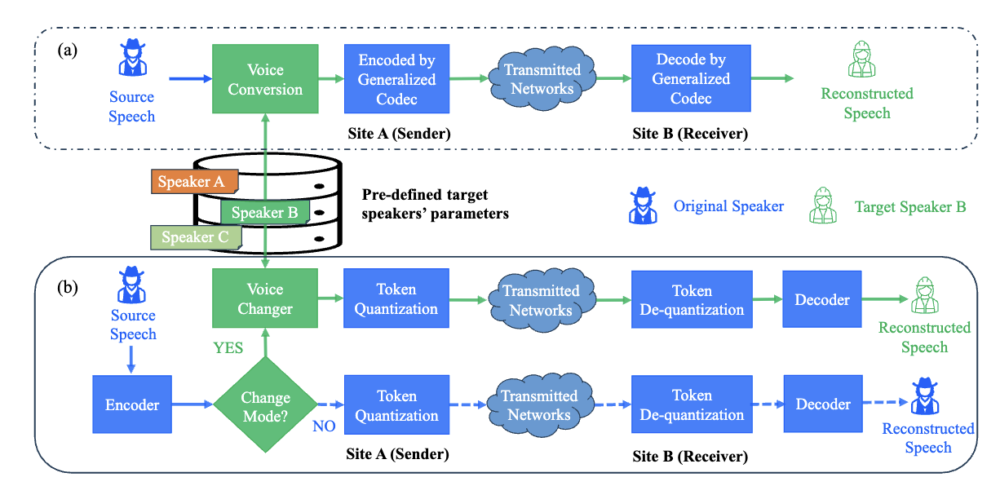

# 
 VChangeCodec: A High-efficiency Neural Speech Codec with Built-in Voice Changer for Real-time Communication 

anonymous authors

## Abstract
Neural speech codecs enable high-quality real-time communication (RTC) at low bit rates, making them efficient for bandwidth-constrained environments. 
However, customizing the timbre of transmitted voices still relies on separate voice conversion (VC) systems, resulting in a cascaded pipeline with high latency.
In this paper, we present _VChangeCodec_, a real-time neural speech codec with native VC capacity and switchable voice modes. 
Specifically, we design a fully causal convolutional network and use the scalar quantization codebook to acquire compact tokens. For voice change mode, leveraging the target speaker's embedding, we incorporate a lightweight causal projection network that can be optionally activated within the encoding module to adapt timbre at the token level. 
These adapted tokens are quantized and transmitted to the decoding module to generate the converted speech of the target speaker.
Experiments demonstrate that our VChangeCodec with fewer than 3M parameters performs competitively in speech reconstruction and excels in timbre adaptation capabilities with an ultra-low latency of 40 ms, making it ideal for RTC scenarios such as online conferencing. 
<!-- 
comments
## Model Overview

-->
# Demo of original voice mode

"Ref" denotes the reference speech. We have provided samples compressed by various codecs, including both signal processing-based and neural-based methods. In these comparisons, "VChangeCodec@9.5kbps" specifically refers to our original voice model.

##     Demo of female

###    English 

 |Ref |Opus@6kbps| Lyra2@6kbps | EVS@7.2kbps | Opus@8kbps | VChangeCodec@9.5kbps| Lyra2@9.2kbps | EVS@9.6kbps | Opus@10kbps | Opus@16kbps|
 |:--- |:--- | :--- | :--- | :--- | :--- | :--- | :--- | :--- | :--- |
 |<audio src="demo_orig/Eng/Female/Female_01.wav" controls preload></audio> | <audio src="demo_orig/Eng/Female/Female_02.wav" controls preload></audio> |<audio src="demo_orig/Eng/Female/Female_03.wav" controls preload></audio> | <audio src="demo_orig/Eng/Female/Female_04.wav" controls preload></audio> | <audio src="demo_orig/Eng/Female/Female_05.wav" controls preload></audio> | <audio src="demo_orig/Eng/Female/Female_06.wav" controls preload></audio> | <audio src="demo_orig/Eng/Female/Female_07.wav" controls preload></audio> | <audio src="demo_orig/Eng/Female/Female_08.wav" controls preload></audio> | <audio src="demo_orig/Eng/Female/Female_09.wav" controls preload></audio> | <audio src="demo_orig/Eng/Female/Female_10.wav" controls preload></audio> |
 |--- | --- | --- | --- | --- | --- | --- | --- | --- | --- |

##     Demo of male

###    English 

 |Ref |Opus@6kbps| Lyra2@6kbps | EVS@7.2kbps | Opus@8kbps | VChangeCodec@9.5kbps| Lyra2@9.2kbps | EVS@9.6kbps | Opus@10kbps | Opus@16kbps|
 |:--- |:--- | :--- | :--- | :--- | :--- | :--- | :--- | :--- | :--- |
 |<audio src="demo_orig/Eng/Male/Male_01.wav" controls preload></audio> | <audio src="demo_orig/Eng/Male/Male_02.wav" controls preload></audio> |<audio src="demo_orig/Eng/Male/Male_03.wav" controls preload></audio> | <audio src="demo_orig/Eng/Male/Male_04.wav" controls preload></audio> | <audio src="demo_orig/Eng/Male/Male_05.wav" controls preload></audio> | <audio src="demo_orig/Eng/Male/Male_06.wav" controls preload></audio> | <audio src="demo_orig/Eng/Male/Male_07.wav" controls preload></audio> | <audio src="demo_orig/Eng/Male/Male_08.wav" controls preload></audio> | <audio src="demo_orig/Eng/Male/Male_09.wav" controls preload></audio> | <audio src="demo_orig/Eng/Male/Male_10.wav" controls preload></audio> |
 |--- | --- | --- | --- | --- | --- | --- | --- | --- | --- |

##     Demo of female
###    Mandarin 

|Ref | VChangeCodec@9.5kbps | DAC@8kbps  | Encodec@12kbps   | SpeechTokenizer| 
|:---: | :---: | :---: | :---: | :---: | 
 |<audio src="demo_orig/female/Ref_p501/p501_CN_F1_68.wav" controls preload></audio> | <audio src="demo_orig/female/VChangeCodec/p501_CN_F1_68.wav" controls preload></audio> |<audio src="demo_orig/female/DAC/p501_CN_F1_68.wav" controls preload></audio> | <audio src="demo_orig/female/Encodec/p501_CN_F1_68.wav" controls preload></audio> | <audio src="demo_orig/female/SpeechTokenizer/p501_CN_F1_68.wav" controls preload></audio> |
 |--- | --- | --- | --- | --- |

##      Demo of male
###     Mandarin 

|Ref | VChangeCodec@9.5kbps | DAC@8kbps  | Encodec@12kbps   | SpeechTokenizer| 
|:---: | :---: | :---: | :---: | :---: | 
 |<audio src="demo_orig/male/Ref_p501/p501_CN_M1_70.wav" controls preload></audio> | <audio src="demo_orig/male/VChangeCodec/p501_CN_M1_70.wav" controls preload></audio> |<audio src="demo_orig/male/DAC/p501_CN_M1_70.wav" controls preload></audio> | <audio src="demo_orig/male/Encodec/p501_CN_M1_70.wav" controls preload></audio> | <audio src="demo_orig/male/SpeechTokenizer/p501_CN_M1_70.wav" controls preload></audio> |
 |--- | --- | --- | --- | --- |

# Demo of voice changer mode

## Demo of target timbre 1

The “target label” denotes the actual target speech signal. 
“Ref” stands for reference timbre of target speaker.
“source” is the input speech signal. “Original” refers to our original voice mode, while “VChangeCodec” refers to our voice changer mode.

**Please slide the mouse to select different files for listening**.

### English 

 |Target label |Ref | Source | Original | VChangeCodec | FACodec| DDDM-VC | QuickVC | DiffVC | VQMIVC|
 |:--- |:--- | :--- | :--- | :--- | :--- | :--- | :--- | :--- | :--- |
 |<audio src="demo_ht/English/Target label/p225_366.wav" controls preload></audio> | <audio src="demo_ht/English/Ref/ref_eng_hutao_p239_503.wav" controls preload></audio> |<audio src="demo_ht/English/Source/p225_366.wav" controls preload></audio> | <audio src="demo_ht/English/Original/p225_366.wav" controls preload></audio> | <audio src="demo_ht/English/VChangeCodec/p225_366.wav" controls preload></audio> | <audio src="demo_ht/English/FACodec/p225_366.wav" controls preload></audio> | <audio src="demo_ht/English/DDDM_VC/p225_366.wav" controls preload></audio> | <audio src="demo_ht/English/QuickVC/p225_366.wav" controls preload></audio> | <audio src="demo_ht/English/DiffVC/p225_366.wav" controls preload></audio> | <audio src="demo_ht/English/VQMIVC/p225_366.wav" controls preload></audio> |
 |--- | --- | --- | --- | --- | --- | --- | --- | --- | --- |

### Mandarin 

  
| Target label                                              |  Ref                                                         | Source                                                      | Original                                                    | VChangeCodec                                                | FACodec                                                    |  DDDM-VC                                                    | QuickVC                                                     | DiffVC                                                      | VQMIVC|                                                      
 |:--- |:--- | :--- | :--- | :--- | :--- | :--- | :--- | :--- | :--- |
  | <audio src="demo_ht/mandarin/Target label/ht_CN_F2_14.wav" controls preload></audio> | <audio src="demo_ht/English/Ref/ref_eng_hutao_p239_503.wav" controls preload></audio> |<audio src="demo_ht/mandarin/Source/ht_CN_F2_14.wav" controls preload></audio> | <audio src="demo_ht/mandarin/Original/ht_CN_F2_14.wav" controls preload></audio> | <audio src="demo_ht/mandarin/VChangeCodec/ht_CN_F2_14.wav" controls preload></audio> | <audio src="demo_ht/mandarin/FACodec/ht_CN_F2_14.wav" controls preload></audio> | <audio src="demo_ht/mandarin/DDDM_VC/ht_CN_F2_14.wav" controls preload></audio> | <audio src="demo_ht/mandarin/QuickVC/ht_CN_F2_14.wav" controls preload></audio> | <audio src="demo_ht/mandarin/DiffVC/ht_CN_F2_14.wav" controls preload></audio> | <audio src="demo_ht/mandarin/VQMIVC/ht_CN_F2_14.wav" controls preload></audio> |
   |--- | --- | --- | --- | --- | --- | --- | --- | --- | --- |

## Demo of target timbre 2

The “target label” denotes the actual target speech signal. “Ref” stands for reference timbre of target speaker. “source” is the input speech signal. “Original” refers to our original voice mode, while “VChangeCodec” refers to our voice changer mode.

**Please slide the mouse to select different files for listening**.

### English 

 |Target label |Ref | Source | Original | VChangeCodec | FACodec| DDDM-VC | QuickVC | DiffVC | VQMIVC|
 |:--- |:--- | :--- | :--- | :--- | :--- | :--- | :--- | :--- | :--- |
 |<audio src="demo_p231/English/Target label/p236_503.wav" controls preload></audio> | <audio src="demo_p231/English/Ref/p231_008_mic2_p231_076_mic2.wav" controls preload></audio> |<audio src="demo_p231/English/Source/p236_503.wav" controls preload></audio> | <audio src="demo_p231/English/Original/p236_503.wav" controls preload></audio> | <audio src="demo_p231/English/VChangeCodec/p236_503.wav" controls preload></audio> | <audio src="demo_p231/English/FACodec/p236_503.wav" controls preload></audio> | <audio src="demo_p231/English/DDDM_VC/p236_503.wav" controls preload></audio> | <audio src="demo_p231/English/QuickVC/p236_503.wav" controls preload></audio> | <audio src="demo_p231/English/DiffVC/p236_503.wav" controls preload></audio> | <audio src="demo_p231/English/VQMIVC/p236_503.wav" controls preload></audio> |
 |--- | --- | --- | --- | --- | --- | --- | --- | --- | --- |

### Mandarin 

| Target label                                              |  Ref                                                         | Source                                                      | Original                                                    | VChangeCodec                                                | FACodec                                                     | DDDM-VC                                                     | QuickVC                                                     | DiffVC                                                      | VQMIVC|                                                      
 |:--- |:--- | :--- | :--- | :--- | :--- | :--- | :--- | :--- | :--- |
  | <audio src="demo_p231/mandarin/Target label/481_0600.wav" controls preload></audio> | <audio src="demo_p231/mandarin/Ref/p231_008_mic2_p231_076_mic2.wav" controls preload></audio> |<audio src="demo_p231/mandarin/Source/481_0600.wav" controls preload></audio> | <audio src="demo_p231/mandarin/Original/481_0600.wav" controls preload></audio> | <audio src="demo_p231/mandarin/VChangeCodec/481_0600.wav" controls preload></audio> | <audio src="demo_p231/mandarin/FACodec/481_0600.wav" controls preload></audio> | <audio src="demo_p231/mandarin/DDDM_VC/481_0600.wav" controls preload></audio> | <audio src="demo_p231/mandarin/QuickVC/481_0600.wav" controls preload></audio> | <audio src="demo_p231/mandarin/DiffVC/481_0600.wav" controls preload></audio> | <audio src="demo_p231/mandarin/VQMIVC/481_0600.wav" controls preload></audio> |
   |--- | --- | --- | --- | --- | --- | --- | --- | --- | --- |

 
 