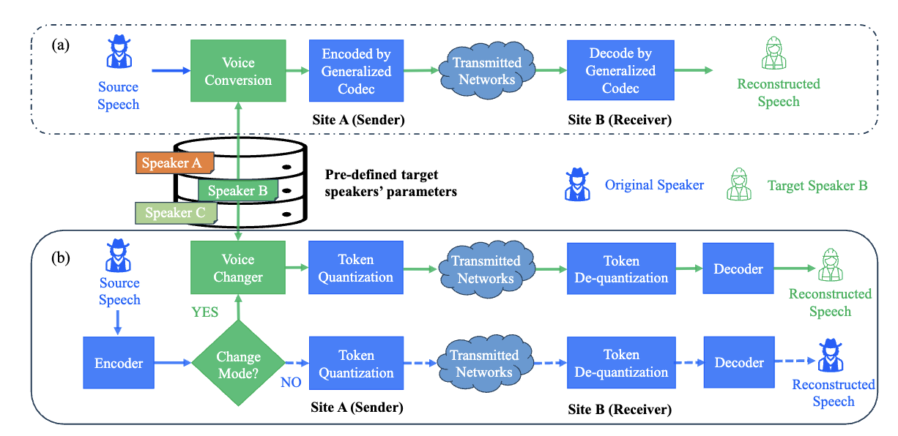

# 
 VChangeCodec: Neural Speech Codec Integrated Customized Voice Changer for Real-time Communication 

anonymous

## Abstract
Neural speech codec provides high quality real-time communication (RTC) at low bitrates. 
Meantime, voice conversion (VC) is recognized as an enriched feature of the RTC service, by personalizing the timbre of the speech. 
However, the VC model requires high complexity and hundreds of millisecond-latency; therefore, existing VC models can only be incorporated into the RTC system as a sound effect pre-processing. 
In this paper, we propose a novel speech codec framework called VChangeCodec, which integrates the VC function into the codec, enabling seamless online switching between the original and customized voice changer modes.
Especially, the voice changer is an integral module of the encoding part and compatible with a pre-trained decoding part, resulting in the \(40\) ms streaming voice changer being feasible in the RTC system. 
Specifically, we design a lightweight causal projection network for the voice changer mode to realize the timbre adaptation on the quantized tokens of the frozen VChangeCodec, given the embedding of the target speaker.
These adapted tokens are dequantized and decoded to realize a customized voice changer.
We provide subjective tests, objective evaluation and comprehensive ablations.
The results prove the merit of our VChangeCodec integrated customized voice changer compared with SOTA VC models.
We hope that our proposal brings enriched features to the RTC ecosystem. 

<!-- 
comments
## Model Overview

-->

## Demo of target timbre 1

The “target label” denotes the actual target speech signal. 
“Ref” stands for reference timbre of target speaker.
“source” is the input speech signal. “Original” refers to our original voice mode, while “VChangeCodec” refers to our voice changer mode.

**Please slide the mouse to select different files for listening**.

### English 

 |Target label |Ref | Source | Original | VChangeCodec | QuickVC | DiffVC | VQMIVC|
 |:--- |:--- | :--- | :--- | :--- | :--- | :--- | :--- |
 |<audio src="demo_ht/English/Target label/p225_366.wav" controls preload></audio> | <audio src="demo_ht/English/Ref/ref_eng_hutao_p239_503.wav" controls preload></audio> |<audio src="demo_ht/English/Source/p225_366.wav" controls preload></audio> | <audio src="demo_ht/English/Original/p225_366.wav" controls preload></audio> | <audio src="demo_ht/English/VChangeCodec/p225_366.wav" controls preload></audio> | <audio src="demo_ht/English/QuickVC/p225_366.wav" controls preload></audio> | <audio src="demo_ht/English/DiffVC/p225_366.wav" controls preload></audio> | <audio src="demo_ht/English/VQMIVC/p225_366.wav" controls preload></audio> |
 |--- | --- | --- | --- | --- | --- | --- | --- |

### Mandarin 

  
| Target label                                              |  Ref                                                         | Source                                                      | Original                                                    | VChangeCodec                                                | QuickVC                                                     | DiffVC                                                      | VQMIVC|                                                      
 |:--- |:--- | :--- | :--- | :--- | :--- | :--- | :--- |
  | <audio src="demo_ht/mandarin/Target label/ht_CN_F2_14.wav" controls preload></audio> | <audio src="demo_ht/English/Ref/ref_eng_hutao_p239_503.wav" controls preload></audio> |<audio src="demo_ht/mandarin/Source/ht_CN_F2_14.wav" controls preload></audio> | <audio src="demo_ht/mandarin/Original/ht_CN_F2_14.wav" controls preload></audio> | <audio src="demo_ht/mandarin/VChangeCodec/ht_CN_F2_14.wav" controls preload></audio> | <audio src="demo_ht/mandarin/QuickVC/ht_CN_F2_14.wav" controls preload></audio> | <audio src="demo_ht/mandarin/DiffVC/ht_CN_F2_14.wav" controls preload></audio> | <audio src="demo_ht/mandarin/VQMIVC/ht_CN_F2_14.wav" controls preload></audio> |
   |--- | --- | --- | --- | --- | --- | --- | --- |

## Demo of target timbre 2

The “target label” denotes the actual target speech signal. “Ref” stands for reference timbre of target speaker. “source” is the input speech signal. “Original” refers to our original voice mode, while “VChangeCodec” refers to our voice changer mode.

**Please slide the mouse to select different files for listening**.

### English 

 |Target label |Ref | Source | Original | VChangeCodec | QuickVC | DiffVC | VQMIVC|
 |:--- |:--- | :--- | :--- | :--- | :--- | :--- | :--- |
 |<audio src="demo_p231/English/Target label/p236_503.wav" controls preload></audio> | <audio src="demo_p231/English/Ref/p231_008_mic2_p231_076_mic2.wav" controls preload></audio> |<audio src="demo_p231/English/Source/p236_503.wav" controls preload></audio> | <audio src="demo_p231/English/Original/p236_503.wav" controls preload></audio> | <audio src="demo_p231/English/VChangeCodec/p236_503.wav" controls preload></audio> | <audio src="demo_p231/English/QuickVC/p236_503 x p231.wav" controls preload></audio> | <audio src="demo_p231/English/DiffVC/p236_503.wav" controls preload></audio> | <audio src="demo_p231/English/VQMIVC/p236_503.wav" controls preload></audio> |
 |--- | --- | --- | --- | --- | --- | --- | --- |

### Mandarin 

| Target label                                              |  Ref                                                         | Source                                                      | Original                                                    | VChangeCodec                                                | QuickVC                                                     | DiffVC                                                      | VQMIVC|                                                      
 |:--- |:--- | :--- | :--- | :--- | :--- | :--- | :--- |
  | <audio src="demo_p231/mandarin/Target label/481_0600.wav" controls preload></audio> | <audio src="demo_p231/mandarin/Ref/p231_008_mic2_p231_076_mic2.wav" controls preload></audio> |<audio src="demo_p231/mandarin/Source/481_0600.wav" controls preload></audio> | <audio src="demo_p231/mandarin/Original/481_0600.wav" controls preload></audio> | <audio src="demo_p231/mandarin/VChangeCodec/481_0600.wav" controls preload></audio> | <audio src="demo_p231/mandarin/QuickVC/481_0600 x p231.wav" controls preload></audio> | <audio src="demo_p231/mandarin/DiffVC/481_0600.wav" controls preload></audio> | <audio src="demo_p231/mandarin/VQMIVC/481_0600.wav" controls preload></audio> |
   |--- | --- | --- | --- | --- | --- | --- | --- |

 
 